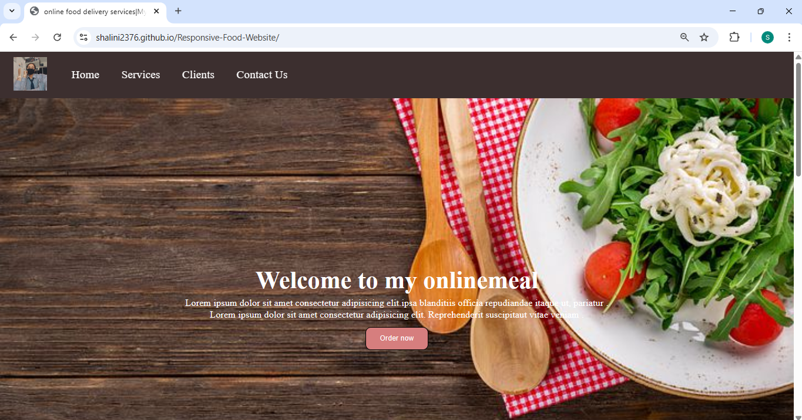
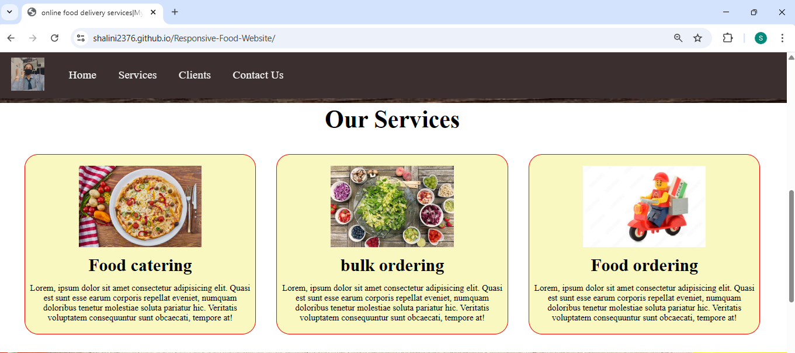
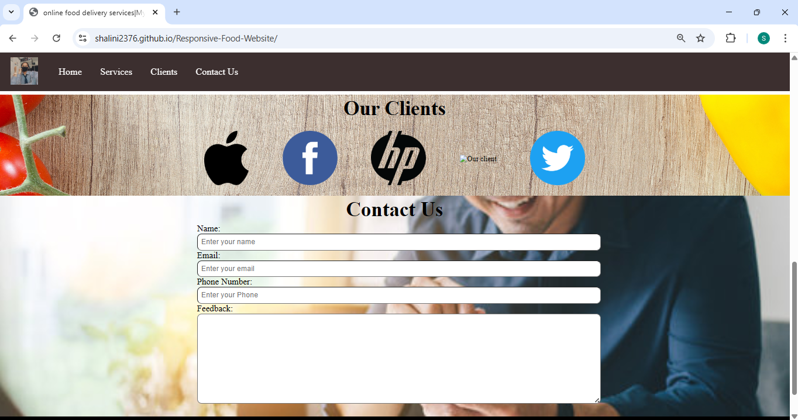

# Project Name

A simple static website built using **HTML and CSS** during the early stages of my frontend learning journey.  
This project focuses on layout structuring, responsive design, and clean UI styling.

## ✨ Features
- Responsive layout for different screen sizes
- Clean and simple UI design
- Semantic HTML structure
- Organized CSS styling

## 🛠 Tech Stack
- HTML5
- CSS3

##  Screenshots 

  
  
  

## 🚀 How to View
1. Clone the repository:
   ```bash
   git clone https://github.com/shalini2376/Responsive-Food-Website
   ```
2. Open `index.html` in your browser.
